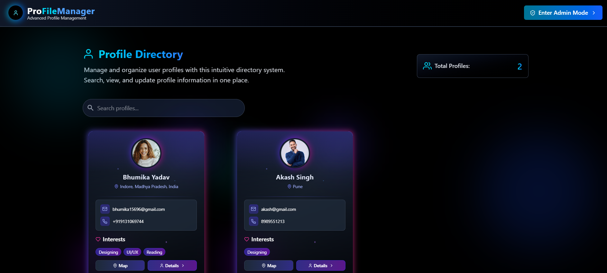
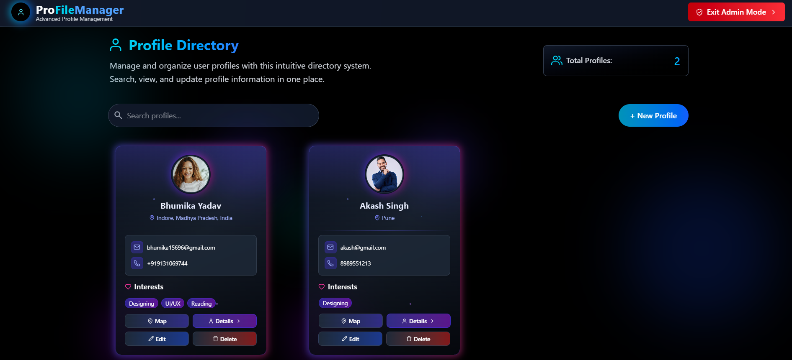
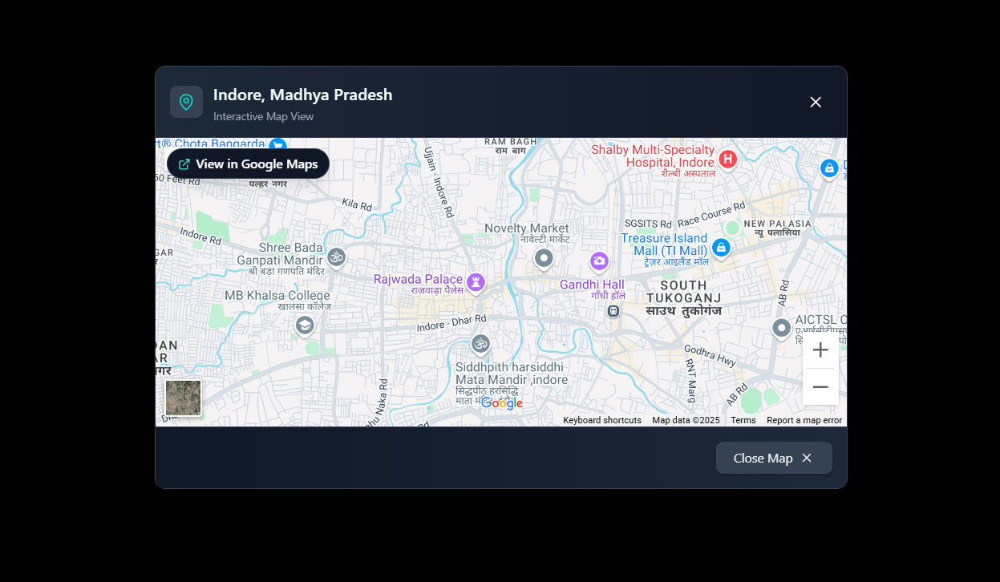
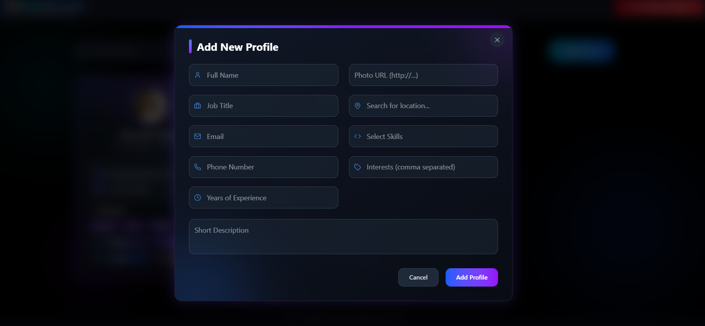

# Profile Manager Web Application

## 📌 Project Description
This is a **Profile Manager Web Application** built using **React** that allows users to browse profiles and view their addresses interactively on a map. The application provides an intuitive and seamless way to explore user profiles and their locations using an interactive mapping component integrated with **Mapbox/Google Maps**.

---

## ✨ Features

### 🔹 User Features
- **Profile Display**: View a list of user profiles with names, photos, and descriptions.
- **Interactive Mapping**: Dynamically view addresses on a map with markers.
- **Summary View**: Click a "Summary" button to highlight the location on the map.
- **Profile Search & Filtering**: Search and filter profiles based on attributes like name or location.
- **Detailed Profile View**: Click on a profile to see in-depth details such as contact information, interests, etc.
- **Mobile Responsive Design**: Fully optimized for mobile, tablets, and desktops.

### 🔹 Admin Features
- **Admin Dashboard**: Manage profile data efficiently.
- **CRUD Operations**: Add, edit, and delete profiles.
- **Form Validation**: Ensure data integrity while managing profiles.

### 🔹 UI/UX Enhancements
- **Loading Indicators**: Show progress when fetching data or loading the map.
- **Error Handling**: Graceful handling of API failures or invalid addresses.
- **Dark Mode Support** (Optional).

---

## 🖼️ Screenshots

### 🔹 Homepage


### 🔹 Admin Panel


### 🔹 Interactive Map


### 🔹 Profile Form


### 🔹 Profile Details Page


---

## 🛠️ Installation & Setup

1. **Clone the Repository**
   ```sh
   git clone https://github.com/Bhumi1729/Profile-Manager.git
   cd profile-explorer
   ```

2. **Install Dependencies**
   ```sh
   npm install  # for React

   ```

3. **Set Up API Keys** (if using Mapbox/Google Maps)
   - Create a `.env` file and add your API keys:
     ```env
     
     REACT_APP_GOOGLE_MAPS_API_KEY=your_google_maps_key
     ```

4. **Run the Application**
   ```sh
   npm run dev  # for React
   
   ```

5. **Access the App**
   - Open `http://localhost:5173/` for React.
   

---


## 🎯 Tech Stack
- **Frontend**: React
- **State Management**: Context api
- **Maps API**: Google Maps API 
- **Styling**: Tailwind CSS

---


## 💡 Future Improvements
- 🌟 Implement user authentication.
- 🌟 Add real-time updates.
- 🌟 Support for multiple map providers.

---

## ✨ Author
- **Bhumika Yadav**
- GitHub: [Your GitHub Profile](https://github.com/Bhumi1729)
- LinkedIn: [Your LinkedIn Profile](https://www.linkedin.com/in/bhumika-yadav/)